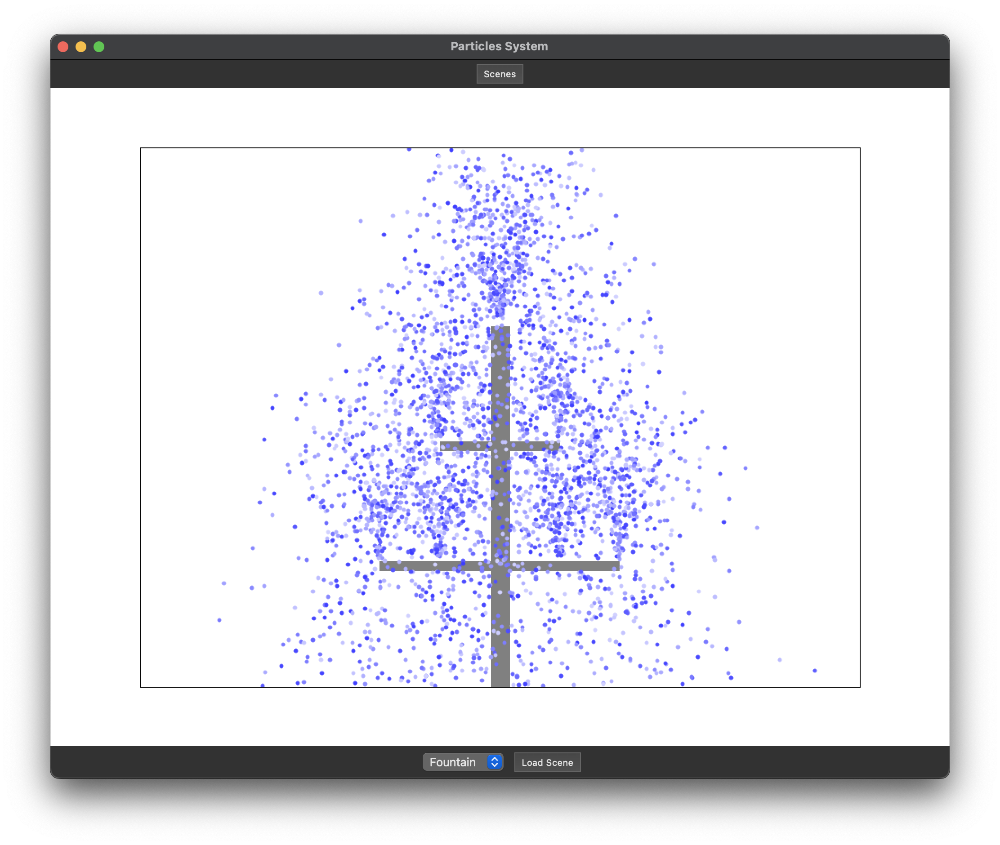

# Particle Systems Project

Welcome to the **Particle Systems** project! This project explores the creation and visualization of a 2D particle system, widely used in animation, simulations, and gaming to create dynamic and visually stunning effects.

---

## Table of Contents
1. [Introduction](#introduction)
2. [Core Features](#core-features)
3. [Visualization with Scenes](#visualization-with-scenes)
4. [Class Overview](#class-overview)

---

## Introduction

Particle systems simulate complex phenomena using large collections of small, simple particles. These systems are essential in computer graphics for creating effects like:
- Fireworks displays
- Fountains and waterfalls
- Explosions and smoke
- Sparkles, trails, and ambient visual effects

This project provides a robust framework for designing and visualizing particle systems, with a focus on modularity and extensibility. Scenes are used as the canvas for rendering dynamic effects, enabling vivid demonstrations of particle behaviors.

---

## Core Features

- **Custom Particle Management:** Implements a doubly linked list for particle storage and lifecycle management.
- **Dynamic Properties:** Each particle is customizable, supporting properties such as color, velocity, lifespan, and motion type.
- **Efficient Culling:** Automatically removes off-screen or expired particles to optimize performance.
- **Scene-Based Visualization:** Combines multiple particle systems into interactive and visually striking scenes.
- **Diverse Effects:** Simulates multiple particle types, including fireworks, fountains, and gravity-driven projectiles.

---

## Visualization with Scenes

The heart of this project lies in its **scene system**, which showcases particle systems in action. Scenes are composed of one or more particle systems, rendered with synchronized updates and animations. Each scene provides a unique perspective on how particles interact with physics and each other.  

### Examples of Scenes:
1. **Fireworks Show:**
   - Particles are launched like rockets and explode into colorful starbursts.
   - Simulates gravity, radial force, and fading trails.

2. **Fountain Display:**
   - Water-like particles are emitted in parabolic arcs.
   - Includes gravity, velocity decay, and splashing effects.

3. **Explosive Burst:**
   - Particles are ejected in all directions with high velocity.
   - Gradually fade or dissipate over time to simulate a realistic explosion.

4. **Ambient Effects:**
   - Small, random particles hover or drift slowly, mimicking sparks or magical glows.
   - Perfect for adding atmospheric effects to larger projects.

## Screenshots
### Volcano 


### Fountain


### Snowy Day


#### Sample Visual Output

| **Scene**           | **Description**                                                                 |
|----------------------|---------------------------------------------------------------------------------|
| Fireworks            | Bright trails shooting into the air, followed by colorful radial explosions.   |
| Fountain             | Smooth arcs of particles, with splashes forming at the base of the scene.      |
| Explosions           | High-energy bursts, with particles slowing down as they disperse outward.      |
| Ambient Effects      | Subtle sparkles or floating particles with randomized motion and soft fading.  |

---

## Class Overview

| **Class Name**    | **Description**                                                                                          |
|-------------------|---------------------------------------------------------------------------------------------------------|
| `Particle`        | Represents a single particle, storing its properties such as position, velocity, color, and lifespan.   |
| `ParticleSystem`  | Manages the creation, movement, and rendering of a group of particles.                                   |
| `Scene`           | Acts as a container for multiple particle systems and handles their rendering and synchronization.       |
| `Renderer`        | Handles the drawing of particles to the screen using primitive shapes (e.g., circles or lines).          |

---

This `README.md` serves as a comprehensive guide for understanding and visualizing the Particle Systems project. Have fun experimenting with your particle effects and pushing the boundaries of what's possible with this framework!
```

Let me know if you’d like additional diagrams, code snippets, or further clarifications added!
